# UI audit, 3 October 2026

A design review of the live waitlist-mode site at phone and desktop widths, with
a ranked list of changes. Each item says what I saw, why it matters, the fix, and
which files it touches.

## Status

| # | Item | Status |
|---|---|---|
| 1 | Desktop nav wrapping at 900 to 1135px | **Built** in this PR |
| 2 | Gold band under the footer on phones | **Built** in this PR |
| 3 | Desktop hero re-composition | **Not doing**: the current hero stays |
| 4 | Floating pill over body copy | Open |
| 5 | Contrast failures | **Built** in this PR |
| 6 | Homepage length | Deep dive in [homepage.md](homepage.md); not built |
| 7 | Email field in the closing CTA | Open |
| 8 | Blog reading width | Open |
| 9 | Tiny type and tap targets | **Built** in this PR |
| 10 | Waitlist-mode buy box | Explained more plainly below; open |

Mockups of the proposals (before and after, both widths) are on a Claude Design
canvas: <https://claude.ai/artifact/MNFEWk6yjQV8LZm7yVmohk>. It is private to
the owner until shared from its Share menu.

## How this was checked

- Production build (`npm run build && npm start`) of `main` at `6356f09`,
  waitlist mode, no preview unlock. The dev server was avoided because the
  dev-only mode toggle and the Next badge change the nav's width.
- Playwright Chromium at **375×812** and **1280×800** for every route, plus the
  hero at 360, 414, 768, 899, 900, 1024, 1280×700, 1440 and 1600×900.
- DOM probes on every page for sideways scroll, tap targets under 36px, text
  under 13px, heading outline, and WCAG contrast of every text node against its
  real background.
- Live mode (prices, basket, gifting) was **not** audited: it is not what
  visitors see today.

## The top ten

| # | Change | Where | Size |
|---|---|---|---|
| 1 | Stop the desktop nav wrapping between 900 and 1135px | Desktop | Small, **bug** |
| 2 | Remove the gold band under every footer on phones | Mobile | Small, **bug** |
| 3 | Re-compose the desktop hero so the buttons sit with the headline | Desktop | Medium |
| 4 | Stop the floating "Join waitlist" pill covering body copy | Mobile | Small |
| 5 | Fix two colour pairs that fail contrast | Both | Small |
| 6 | Shorten the homepage from 14 phone screens to about 9 | Both | Bigger |
| 7 | Show the email field in the closing CTA | Both | Small |
| 8 | Give blog posts a proper reading width | Both | Small |
| 9 | Lift the floor on tiny type and small tap targets | Mobile | Small |
| 10 | Give the waitlist-mode shop page one clear ask | Both | Medium |

Items 1, 2, 5 and 9 are mechanical and could ship together in one afternoon.
Items 3, 6 and 10 change what people see and want a decision first.

---

### 1. The desktop nav wraps between 900 and 1135px (bug)

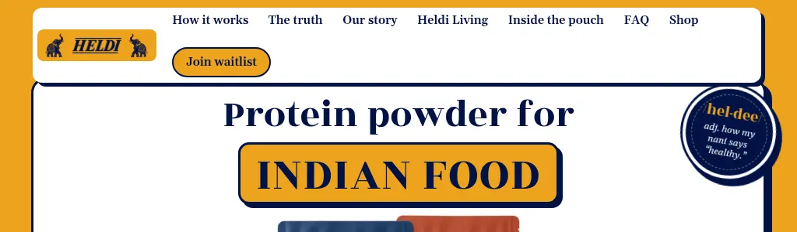
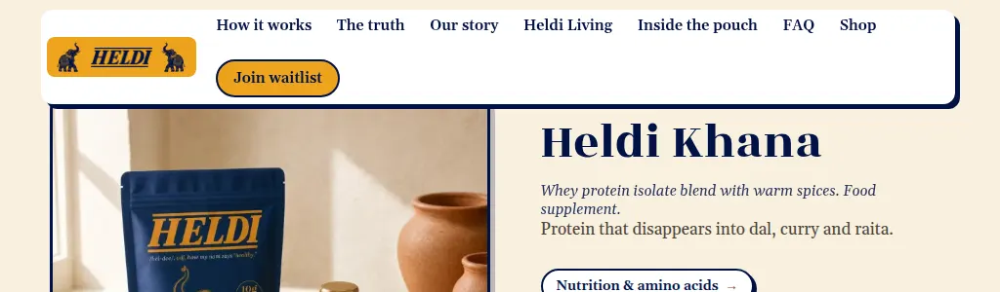

After, at 1024px, with the More menu open:

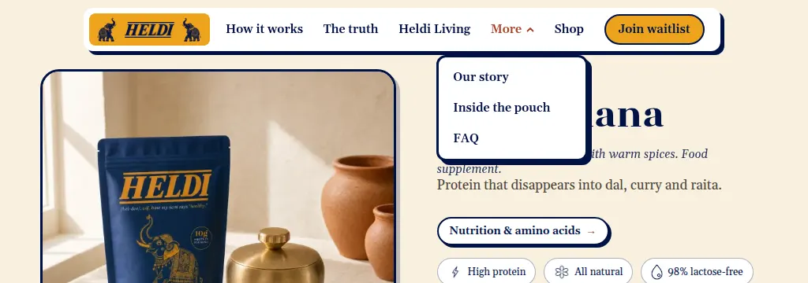
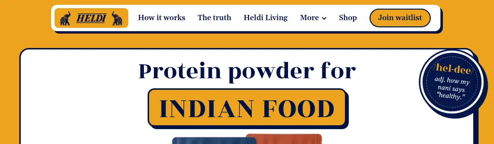

**What I saw.** Measured every 20px from 900 to 1300: the nav card is 54px tall
from 1140px up, and 93 to 99px tall at every width from 900 to 1120, because the
seven links and the join pill drop to a second row. The taller card then sits on
top of the page: it overlaps the hero card by 4 to 9px on the homepage, and on
`/shop/khana` it hides the "THE HELDI POUCH" eyebrow and the top of the product
photo. A 1024px iPad in landscape and most small laptops land in this band.
PLAYBOOK R5 already names 900 to 1100px as the tight spot.

**Why.** `.nav-links` has `flex-wrap: wrap` (`app/globals.css:218`) and the card
is capped at `calc(100vw - 5.5rem)` (`app/globals.css:129`), so when the links
do not fit they wrap silently instead of failing visibly.

**What was built.** At 900px the row needs about 1,005px and the card gets
812, so folding two links was not enough. From 900 to 1139px only, **Our story,
Inside the pouch and FAQ** fold into a "More" disclosure
(`components/nav-more.tsx`): a real button with `aria-expanded`, closed by
Escape (focus returns to the button), a click outside, a link click or a
resize. The row then needs about 600px at 900. The structural breakpoint stays
at 900; this is the "fine-tune inside a component" case PLAYBOOK §1.1.3 allows.
The nav also got an ink focus ring, because the global white ring was invisible
on the white card. `flex-wrap: nowrap` was **not** added: in a preview-unlocked
browser the mode toggle joins the row and would then overflow the card instead.

- Mobile: unchanged (burger sheet).
- Desktop 900 to 1139px: How it works, The truth, Heldi Living, More, Shop,
  Join waitlist. One row, 54px tall at every width from 900 to 1300 (measured
  every 20px).
- Desktop 1140px up: unchanged.

### 2. A gold band under every footer on phones (bug)

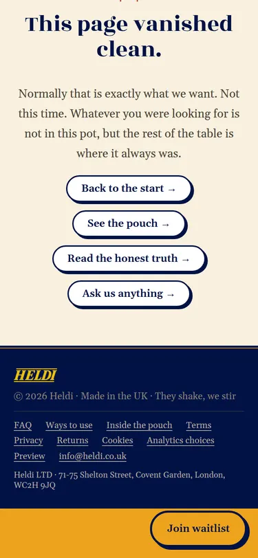
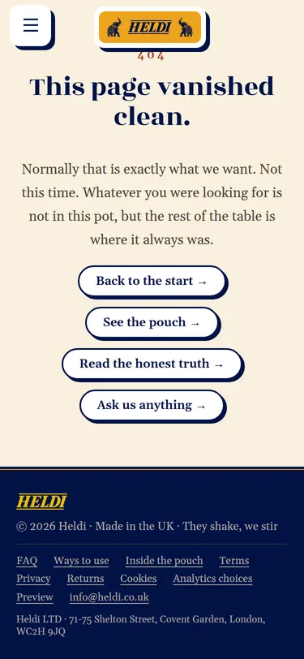

**What I saw.** Every page on a phone ends navy footer, then a 72px strip of
gold. It is most obvious on short pages like the 404, where the floating pill
also sits on the footer's address line.

**Why.** At 899px and below `main { padding-bottom: 4.5rem }`
(`app/globals.css:3338`) reserves room for the floating pill. The footer is
inside `main` and the `body` background is gold, so the reserve shows as a gold
band. It is also applied where the pill never appears: live mode, `/legal`,
`/review` and `/preview` (`HIDDEN_PREFIXES` in
`components/floating-waitlist-cta.tsx`).

**What was built.** Both footers now carry `data-floating-cta-suppress`, so the
pill steps aside as the footer arrives and never sits on the address. With the
pill out of the way there, `main` needs no bottom padding at all, so it is
gone. Every phone page now ends on the navy footer (measured: 0px below it on
the 404, `/truth` and the homepage), and the pill still appears mid-page as
before.

### 3. Re-compose the desktop hero

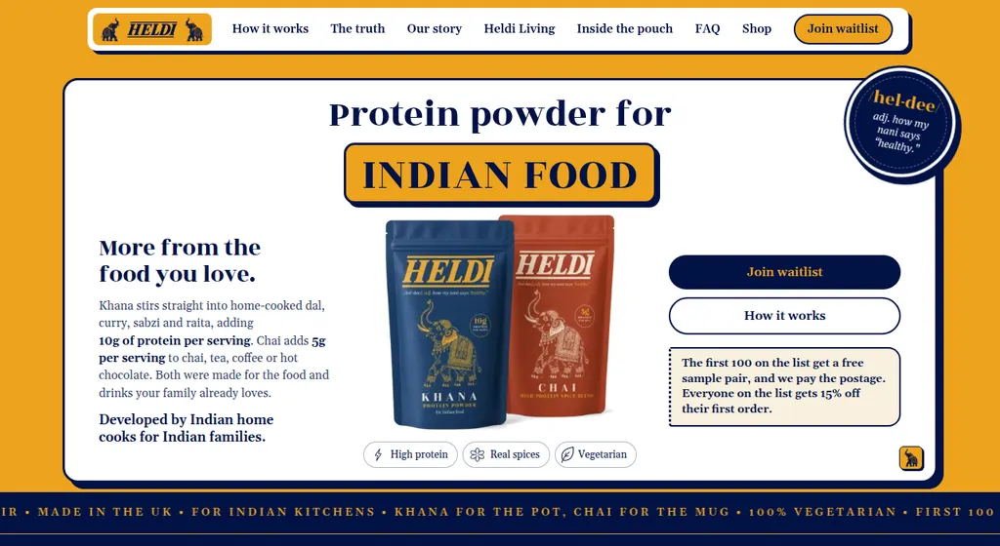

**What I saw.** At 1280 the reading order is: headline (centre), pouches
(centre), then the eye has to jump to the far right for the two buttons and the
offer, and to the far left for the story copy, which is 15.4px in a 298px
column. The primary button is the third thing you find. "More from the food you
love." is styled like a second headline and competes with the H1. The same
three-column split carries down to 900px, where the left column gets very
narrow.

**Fix.** Same white card, sticker, word badge and pills, two columns:

- Left: "Protein powder for" plus the word badge, left-aligned; one support
  paragraph at about 18px that opens with "More from the food you love." in
  bold; the two buttons side by side; the offer ticket under them.
- Right: the pouch pair with the three pills and the "Developed by Indian home
  cooks for Indian families" line beneath.

Mobile is unchanged; the phone hero already reads top to bottom. The mock is
board 3 on the Design canvas. While in there, `text-wrap: pretty` on
`.hero-card__support` (`app/globals.css:776`) would stop "adding" being
orphaned before the nowrap grams span, which happens at 1280 and 1600 today.

### 4. The floating pill covers body copy on phones

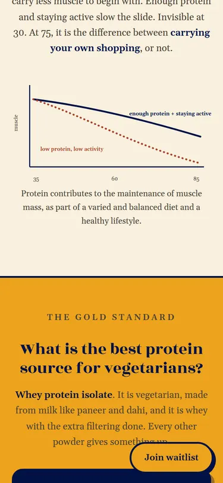

**What I saw.** The pill is suppressed near in-place CTAs, which is good, but
through the middle of every long page it sits on top of a paragraph's last
words. On the truth page, the blog and inside-the-pouch it covers text in most
scroll positions.

**Fix, pick one.**

- Cheapest: hide it while scrolling down and show it on the way up, reusing
  the logic in `components/use-nav-scroll-hide.ts`, so it behaves like the nav.
- Better for conversion: a slim full-width bar fixed to the bottom with a short
  offer line ("The first 100 get a free sample pair.") and the gold pill, with
  `env(safe-area-inset-bottom)` padding, hidden on scroll down. The short line
  would need adding to `lib/waitlist-offer.ts`, since no surface may type the
  offer itself.

Either way, item 2's fix gives it a navy place to land at the end of the page.

### 5. Two colour pairs fail contrast

| Pair | Ratio | Where it shows up |
|---|---|---|
| `--muted` #8a8378 on cream | 3.31:1 | Statutory wording on home, Khana, Chai and FAQ (`.heldi-disclaimer`), truth sources, story notes, ways notes, the "Have a look at the Chai pouch" link |
| `--muted` on white | 3.75:1 | Range card notes, Chai "in the pouch" note, review form legal line |
| `--muted` on gold | 1.76:1 | The `.story-note` on `/shop` |
| `--terracotta` on gold | 2.81:1 | Eyebrows on gold (home "TWO POUCHES", `/shop`, `/ways-to-use`, `/review`) and the founder signature |

The statutory wording is the one that matters most: it is the legally required
supplement text and should be comfortably readable.

**What was built.** `--muted` is now **#736b60** (4.63:1 on cream, 5.25:1 on
white). The footer, which sat muted-on-ink, moved to `--dark-muted` so it does
not get darker on navy. Eyebrows and story notes straight on a gold section, and
the founder signature, are now `--brown` (4.63:1), matching the truth sections;
eyebrows inside cream sticker cards on gold keep terracotta, since they sit on
cream. BRAND.md §8.1, the specimen, the print guide and the go-live checklist
item are updated. A probe of every text node on 14 routes at 375 and 1280 now
finds no text below AA.

### 6. The homepage is too long

| | Blocks (incl. footer) | Height | Screens |
|---|---|---|---|
| Phone, today | 15 | 11,700px | 14.4 |
| 1280, today | 14 | 11,340px | about 14 |
| Phone, proposed | 12 | about 7,500px | about 9 |

Measured section by section at 375px (tallest first): FAQ 1,360, vs-the-shaker
1,280, hero 1,058, menus 962, truth 926, jar 857, how 842, stir 778, range 764,
founder 642, audience 630, pouch stats 623, closing CTA 379, statutory 296,
footer 230.

Several sections say the same thing: the stir gallery and the menus are both
"a dish and its grams"; "How it works" is a four-card preview of `/ways-to-use`;
the pouch stats repeat the hero pills and the shop page; the homepage carries
thirteen FAQs, all of which `/faq` already holds.

**Deep dive:** [homepage.md](homepage.md) has the section-by-section verdicts and
measured savings (14.5 to 9.8 phone screens without touching the hero). The
first-pass proposal below is superseded by it.

**First-pass proposal** (board 6 on the canvas), keeping the ground colours alternating:

1. Hero
2. One for the pot. One for the mug. (moved up: it is the first question a
   visitor has after the hero)
3. Stir it into everything
4. How it works, one card and "See every way to use it"
5. That 18g figure? It's for dry dal.
6. Heldi vs the shaker, scorecard only on phones
7. Founder band, with the three audience lines folded in
8. Five FAQs and "See the full FAQ"
9. A jar for the table
10. Be first to stir it in, with the email field (item 7)
11. Statutory statements
12. Footer

Moved, not deleted: the menus go to `/ways-to-use`; the pouch stats section
goes (its "All natural" stat is also the claim `docs/go-live-checklist.md`
calls the weakest on the site). This one needs a decision from you before
anyone builds it. If you only take one piece, cutting the homepage FAQs from
thirteen to five saves about 700px on a phone on its own.

### 7. Show the email field in the closing CTA

**What I saw.** "Be first to stir it in." ends on one square "Join waitlist"
button that opens the popup. It is the only square primary button on the
public site (everything else is a pill), and it adds a click at the point of
highest intent.

**Fix.** In `components/heldi-homepage.tsx:1545` render
`<WaitlistForm ... id="footer-email" startExpanded buttonStyle="pill" />`.
Desktop: the field and the pill on one row, max 560px, the weekly-letter
checkbox under. Mobile: stacked, full width. The `waitlist_signup` event and
its `placement` stay exactly as they are (PLAYBOOK §7). Board 7 on the canvas.

### 8. Give blog posts a proper reading width

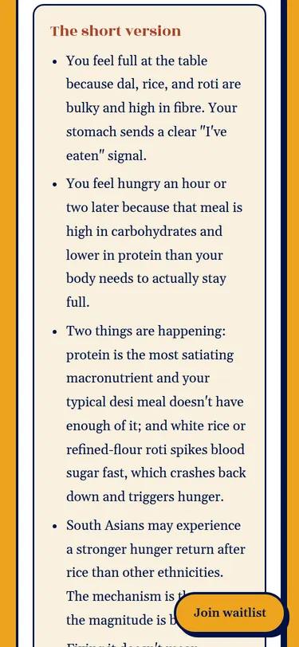
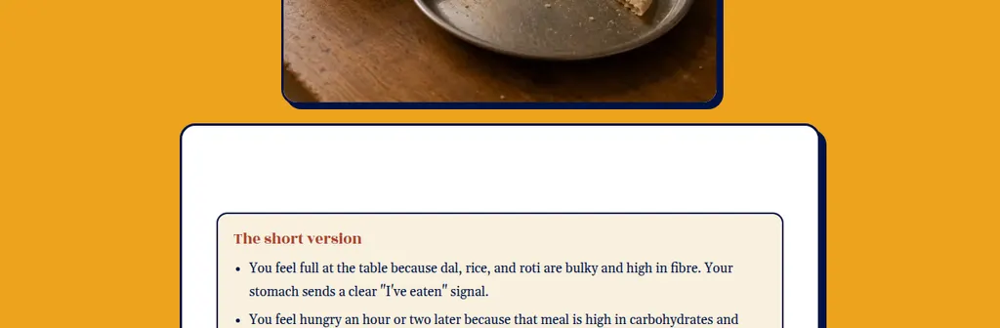

**What I saw.** On a phone the article sits in a white card inside the gold
page gutter, so the text column is 293px, about 35 characters a line. On a
1280 laptop it is 726px at 17px, about 86 characters, past the 65 to 75 that
PLAYBOOK §1.1.5 asks for.

Separately, `content/heldi-living/will-i-get-bulky-if-i-have-too-much-protein.html`
starts with `<h1> </h1>`. It renders a blank band at the top of the card and
gives the page a second h1. Its slug also no longer matches its title ("Why
your dal feels filling but you're hungry an hour later").

**Fix.**

- Mobile: drop the card frame for the article body (`.living-post-panel`,
  `app/globals.css:5721`) and run it full width on cream with the standard
  gutter: 335px of text. Keep the gold header with the title.
- Desktop: cap the body at `max-width: 66ch`.
- Delete the empty `<h1>`. Renaming the slug is optional and needs a redirect
  in `next.config.ts` if you do it.

### 9. Lift tiny type and small tap targets

**Type under 12px** on phones: menu card course labels (`.menu-card__course h4`,
10px, twenty of them), `.menu-card__tag` and `.menu-card__grams-note` (10px),
`.stir-card__tag` (10px), `.living-card__tag` (11px), `.hero-card__pill`
(11.5px). The menu cards are where the grams story lives, and on a phone they
are the hardest thing on the site to read.

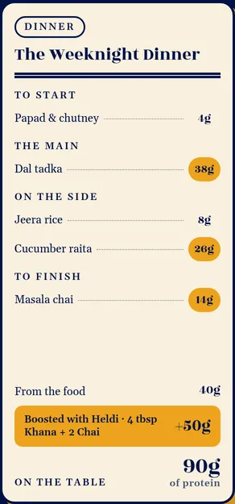

**Tap targets** below PLAYBOOK §1.3.5's 36px: the stir and ways gallery dots
(10×10, `app/globals.css:3910` and `:9110`), menu and audience dots (30×30),
the call-the-elephants button (30×30), blog card tags (24px tall) and the
`/ways-to-use` jump chips (32px tall).

**What was built.** Every label below 12px is now 12px (menu card tags,
course labels, "of protein", "ON THE TABLE", "SELECT YOUR MAIN", stir card
tags, hero pills, blog tags, truth bowl names, powder labels, the Our story
badges, the "Shakes" header) and the vs-the-shaker sentences are 13px. All four
gallery dot rows are 36px buttons painting the same small dot (the menu and
audience galleries already used that pattern at 30px). The elephants button and
the blog tags keep their drawn size with a 36px+ invisible tap area, the blog
filter chips went from 34 to 36px, and the `/ways-to-use` jump chips to 36px.
The hero pills still fit on one line at 360px.

**Left alone:** the italic line inside the round /hel-dee/ sticker (10px on
phones). It is set into a fixed-size stamp, and enlarging it would mean
redrawing the sticker.

### 10. One clear ask on the waitlist-mode shop page

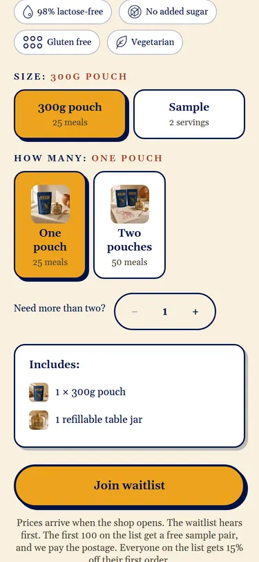

**What I saw, plainly.** Before launch, the box on the Khana page where you
would normally buy asks three questions:

1. Which size? (300g pouch, or a sample)
2. How many? (one pouch, or two)
3. "Need more than two?" with a minus, a number and a plus

But nothing can be bought yet. There are no prices, and whatever you pick, the
only button underneath is "Join waitlist", which opens the same email popup as
every other "Join waitlist" button on the site. Your choices are not sent with
your email. So a visitor makes three decisions that change nothing.

A smaller confusion on top: the counter shows "1" right next to the
highlighted "One pouch" card, which looks like two controls for the same
number.

**The suggestion.** Until the shop opens, swap the three pickers for one simple
box: what a pouch order includes (the 300g pouch and the free table jar, which
the "Includes" card already lists), the waitlist offer, and the email field
with the button. On launch day the full picker comes back exactly as it is
today, because it is only hidden in waitlist mode (`components/shop/buy-box.tsx`).
Board 10 on the canvas shows it.

**The case for keeping it.** Picking a quantity fires the `tier_selected`
analytics event even in waitlist mode, so the pickers tell you how many pouches
people intend to buy before you have a single order. If that signal matters,
keep the pickers but hide the counter until "Two pouches" is chosen, and add a
line saying the choice is just for show until launch.

---

## Also worth doing (smaller)

- **Range cards on desktop are very tall.** The 1:1 photos make each card about
  640px tall, so on an 800px laptop "Meet Khana" is below the fold. A 4:3 crop
  at 900px and up (`.range-card__media`, `app/globals.css:9211`) fixes it.
- **The jar section shows the pouch.** "A jar for the table. On us." uses
  `jar-pouch.webp`, where the jar is small beside the pouch
  (`components/heldi-homepage.tsx:1523`). The copy is about the jar; the brass
  jar and spoon shot (`/images/shop/gift-jar-brass-spoon.webp`) would carry it.
- **The public footer links to `/preview`.** That is the internal unlock page
  (`components/subpage-nav.tsx:163`). Reach it by URL only.
- **"Have a look at the Chai pouch" on Our story** is a link styled as a muted
  italic caption (`app/our-story/page.tsx:287`), so it reads as a note, not a
  way forward. Make it a `.pill-link`.
- **The homepage statutory block** has about 90px of empty cream above its rule
  on both widths. Tighten its top padding.
- **First visit stacks two interstitials.** The elephant curtain plays for about
  three seconds, then the consent modal lands centred over the hero, so a new
  visitor sees two full-screen moments before the headline. On phones, a bottom
  sheet for consent, opened after the curtain finishes, keeps the hero visible.
  (Headless Chromium has no H.264, so in testing the curtain showed as plain
  gold; a real browser shows the elephants.)
- **768px tablets get the phone layout stretched.** Pills and pouches look
  small in a very wide card. Capping the hero card around 560px below 900px
  keeps the phone design's proportions without a new breakpoint.

## What is working, keep it

- No page scrolls sideways at 375 or 1280. Every rail and table is contained.
- The shape language is consistent everywhere: ink borders, hard shadows, pill
  buttons, the ticket offer. The site looks like one brand on every route.
- The phone layouts are genuinely different designs, not squeezed desktops:
  the vs-shaker scorecard, the snap rails with dots, the stacked Chai method.
- Real buttons, labels and radio inputs throughout; one h1 per page except the
  blog post in item 8.
- The Khana and Chai gallery stays sticky on desktop while the buy box scrolls.

## Screenshots in this folder

| File | What |
|---|---|
| `nav-1024-home.webp`, `nav-1024-khana.webp` | Item 1 at 1024×768 |
| `footer-band-375.webp` | Item 2, bottom of the 404 page |
| `hero-1280x700.webp` | Item 3 |
| `floating-pill-375.webp` | Item 4, `/truth` |
| `post-375.webp`, `post-empty-h1-1280.webp` | Item 8 |
| `pdp-buybox-375.webp` | Item 10 |
| `first-visit-375.webp` | First visit, consent modal over the hero |
| `after-*.webp` | Items 1, 2 and 9 after the fixes in this PR |
